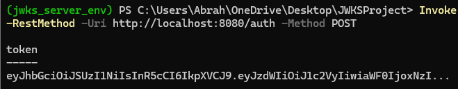
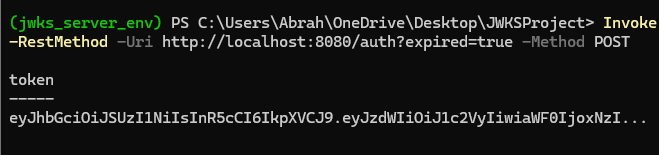
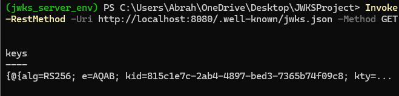

# Project 1: JWKS Server
# Abraham Saidy
# CSCE 3550
# Fall 2024

In this project, a JWKS(JSON Web Key Set) server is implemented that provides public keys to verify JWTs(JSON Web Tokens). RSA key pairs are generated and associated with key IDs that are unique to each pair. The keys are put in a JWKS format. 

# Screenshots:

- **Valid JWT**:
  

- **Expired JWT**:
  

- **JWKS (Public Keys)**:
  

- **Test Results**:
  

- **Test Coverage**:
  

- **Linting Results**:
  